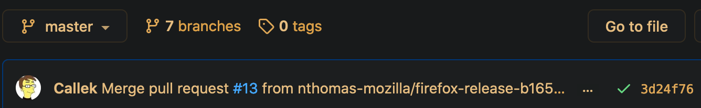

# Release Engineering docs

This document is for Release Engineering, on how to maintain this repo, and how to deal with ad-hoc signing requests.

1. Find out what needs signing, and why
   1. Make sure the signing format is a [supported signing format](https://github.com/mozilla-releng/adhoc-signing/search?q=supported_signing_formats&unscoped_q=supported_signing_formats). (These are currently only Firefox Release cert formats.)
   2. Make sure this is a valid request.
2. Get the binary to sign. This can be via bug attachment, taskcluster artifact link, magic wormhole, Firefox Send.
3. Calculate the checksum and the filesize:
   ```
   openssl sha256 <filename>
   cat <filename> | wc -c
   ```
4. Create a pull request, adding a new signing manifest to the [signing manifest directory](https://github.com/mozilla-releng/adhoc-signing/tree/master/signing-manifests). Use the [template](https://github.com/mozilla-releng/adhoc-signing/blob/master/signing-manifests/example.yml.tmpl) and create a new `.yml` file.
5. Get review, and merge.
6. Promote your manifest to get a valid release signature. Someday these steps will be in shipit, but for now:
   - Go to the merge taskgroup. Generally this is linked from the status symbol of the latest merge to master: a yellow dot for in-progress, a red X for failure, and a  for success. Click it.
   - Click on `details` of the decision task, then `View task in taskcluster` to go to the decision task. This task will need to be green before we can proceed.
   - Go to the task group view: Either click on `Task Group` at the top left, or change the `tasks/TASKID` to `tasks/groups/TASKID` in the url bar.
   - Click the vertical three dots in the lower right, and choose `Promote an adhoc signature`. You will need to be signed in for this to work. The sign-in link is in the top right.
   - In the `Promote an adhoc signature` page, fill in the `adhoc_name`. This will match the name of the new signing manifest, minus the trailing `.yml`. So if you just added `bug12345.yml` for this signing request, your `adhoc_name` would be `bug 12345`.
   - Click `Promote an Adhoc Signature` in the bottom right. This will spawn an action task. Once it goes green, go to the action task group by changing the url from `tasks/TASKID` to `tasks/groups/TASKID`. (The `Task Group` link in the top left will bring you to the *decision task group*, not the *action task group*.) The `release-signing` task will have the signed artifact.
